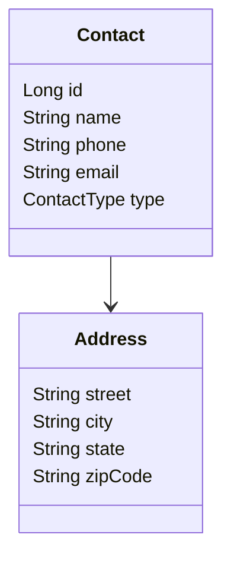

# PhoneBook API


Sistema de agenda telefônica desenvolvido com Spring Boot.

Permite cadastrar, listar, atualizar, buscar e remover contatos, utilizando arquitetura em camadas, persistência com JPA/Hibernate e interface web com Thymeleaf.

## Tecnologias Utilizadas

- Java 17
- Spring Boot
- Spring Data JPA
- Hibernate
- H2 Database
- Thymeleaf
- Maven
- Bean Validation
- Swagger / OpenAPI

- ## Funcionalidades

- Cadastro de contatos
- Atualização de contatos
- Exclusão de contatos
- Busca por ID
- Busca por nome
- Listagem de contatos
- Validação de dados
- Tratamento global de exceções
- Interface Web com Thymeleaf
- Documentação automática com Swagger

- ## Arquitetura

O projeto segue uma arquitetura em camadas:

Controller
↓
DTO
↓
Service
↓
Repository
↓
Database

## Estrutura do Projeto

```text
src/main/java/com/eric/phonebook

├── controllers
│   ├── ContactController
│   └── WebContactController
│
├── dto
│   ├── ContactDTO
│   └── AddressDTO
│
├── entities
│   ├── Contact
│   └── Address
│
├── repositories
│   └── ContactRepository
│
├── services
│   └── ContactService
│
├── exceptions
│   ├── ContactNotFoundException
│   ├── DatabaseException
│   └── ResourceExceptionHandler
│
└── config
    └── TestConfig
```

## Modelo de Dados



## Como Executar

### Clonar o projeto

```bash
git clone https://github.com/seuusuario/phonebook.git
```

### Entrar na pasta

```bash
cd phonebook
```

### Executar

```bash
mvn spring-boot:run
```

## Banco de Dados H2

Console disponível em:

http://localhost:8080/h2-console

Configuração:

JDBC URL: jdbc:h2:mem:testdb
User: sa
Password:

## Documentação da API

Após iniciar a aplicação:

http://localhost:8080/swagger-ui.html

ou

http://localhost:8080/swagger-ui/index.html

## Exemplo de Cadastro

POST /contacts

```json
{
  "name": "Eric Vieira",
  "phone": "11999999999",
  "email": "eric@email.com",
  "type": "FRIEND",
  "address": {
    "street": "Rua A",
    "city": "São Paulo",
    "state": "SP",
    "zipCode": "01234-000"
  }
}
```

## Melhorias Futuras

- PostgreSQL
- Docker
- Spring Security
- Login de usuários
- Paginação
- Testes unitários
- Deploy em nuvem

- ## Autor

Eric Vieira

Desenvolvedor Backend Java

LinkedIn: https://www.linkedin.com/in/ervp
GitHub: https://github.com/ericvpereira
